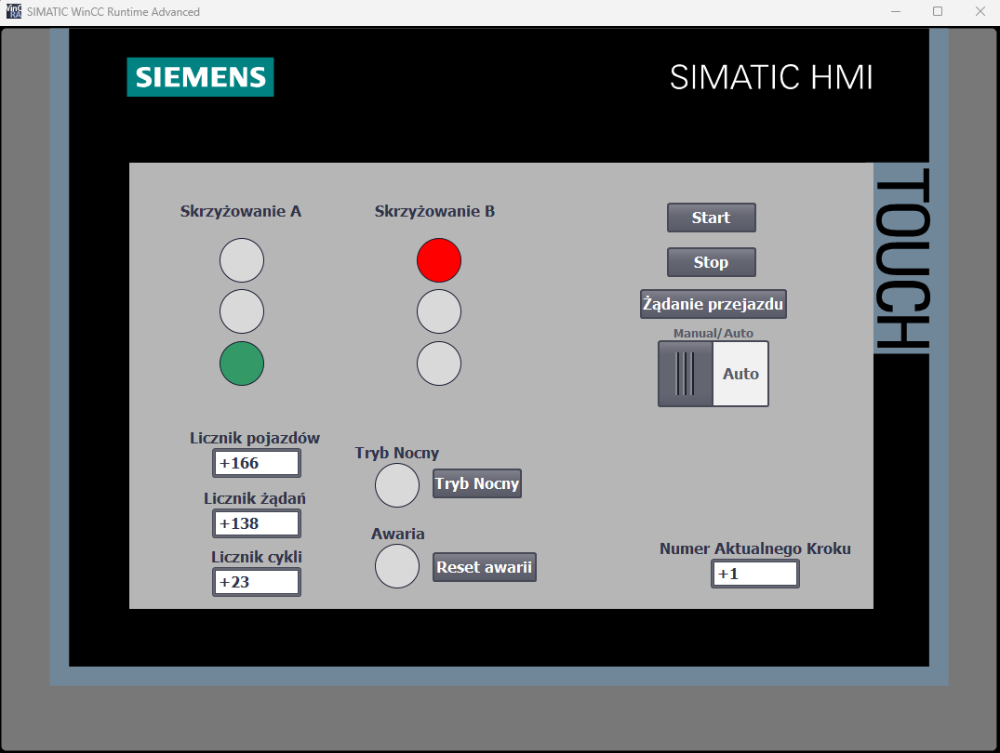
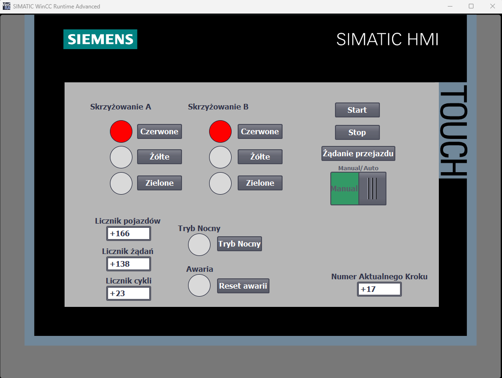
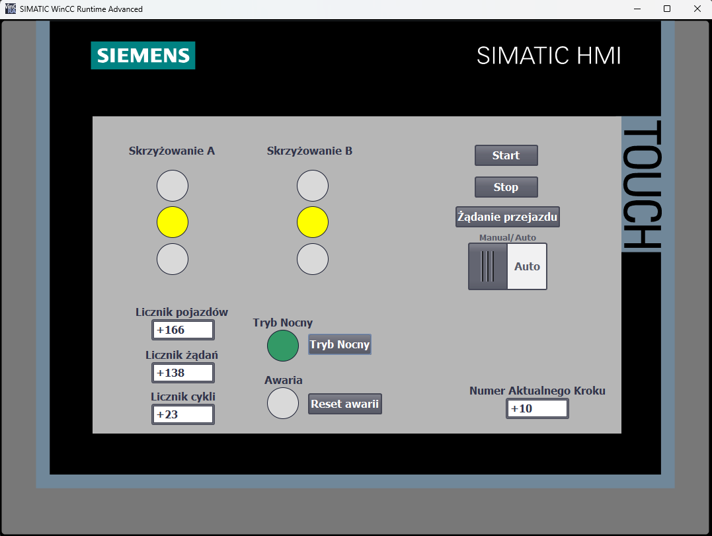
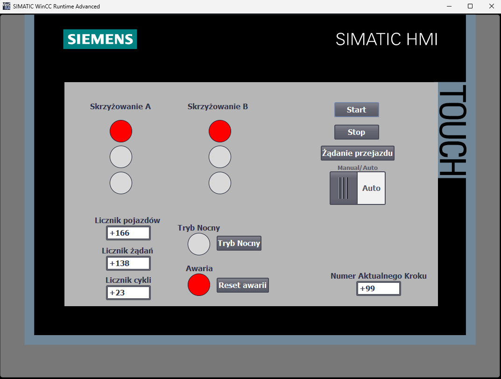
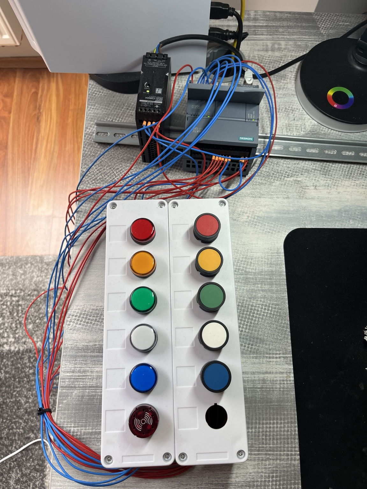
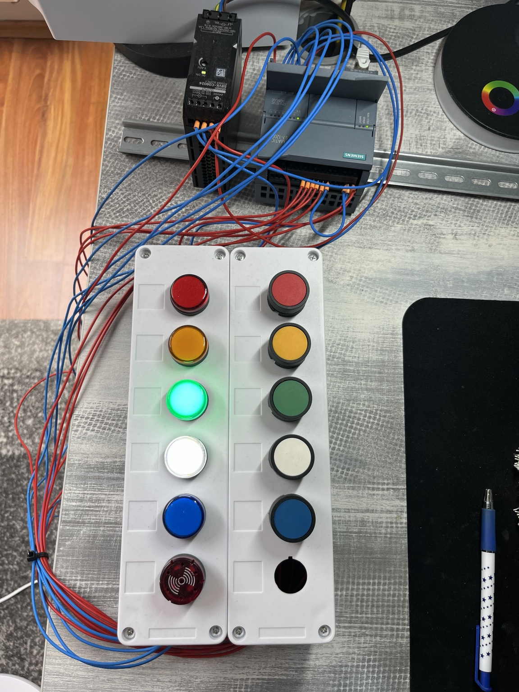

# S7-1200 Intersection Control

A simple traffic intersection control system created as my first PLC project.

The project was developed in **TIA Portal V17** using a physical **Siemens S7-1200 CPU 1212C DC/DC/DC**.  
The control logic was written in **LAD**, and a **WinCC HMI** was created for control and visualization.

## Features

The project includes:

- Automatic traffic light sequence
- Vehicle sensor simulation using a physical input
- Manual control mode
- Night mode with flashing yellow lights
- START and STOP control from physical buttons and HMI
- Fault detection and fault reset
- Vehicle, request and cycle counters
- HMI visualization of traffic lights and current program step
- Safe transitions between AUTO, MANUAL and NIGHT modes
- Interlock preventing both directions from receiving a green light at the same time

## Hardware and Software

**Hardware:**
- Siemens S7-1200 CPU 1212C DC/DC/DC
- 24 V DC power supply
- Physical push buttons
- Signal lamps
- Custom training panel

**Software:**
- Siemens TIA Portal V17
- LAD (Ladder Logic)
- WinCC Runtime Advanced

## Operating Modes

### AUTO

In automatic mode, the PLC controls the traffic light sequence.  
A vehicle request can be generated using the simulated vehicle sensor or the HMI.

### MANUAL

Manual mode allows the operator to control the traffic lights from the HMI.

The PLC still controls the allowed transitions to prevent conflicting traffic directions.

### NIGHT

In night mode, the yellow lights for both directions flash.

### FAULT

The program includes a fault state for an invalid traffic light condition.

When a fault is detected, the program enters fault step 99. The fault can be reset using a physical button or the HMI.

## Physical Setup

The program was tested using a physical S7-1200 PLC and a training panel with push buttons and signal lamps.

### System Running

Additional photos of the PLC input and output wiring are available in the [`Hardware`](Hardware/) folder.

## Testing

Basic functional tests were performed on the physical PLC setup and HMI.

The tests included:

- AUTO sequence
- Manual control
- Night mode
- Mode transitions
- START and STOP
- Fault detection and reset
- Counters
- HMI operation
- Traffic light interlocks

All tested functions operated as expected.

The test results are available in:

[`Documentation/Functional_Tests.pdf`](Documentation/Functional_Tests.pdf)

## Project Files

The complete TIA Portal V17 project archive is available here:

[`TIA_Project/S7-1200_Intersection_Control.zap17`](TIA_Project/S7-1200_Intersection_Control.zap17)

The PLC program printout is available here:

[`Documentation/PLC_Program.pdf`](Documentation/PLC_Program.pdf)

## Language

The PLC program was originally developed in Polish.  
Repository documentation is provided in English.

## Note

This is an educational project created for learning PLC programming, HMI development and basic automation concepts. It is not intended for use in a real road traffic control system.
